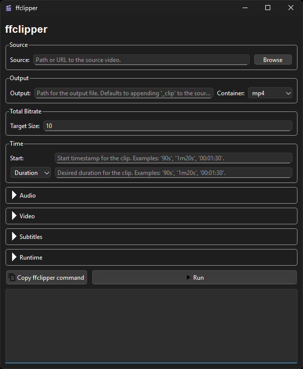

# ffclipper

A lightweight frontend for ffmpeg (yet another one) intended specifically for convenient video clipping.
Easily clip out a section from a source clip with sensible defaults, so you don’t need to remember ffmpeg flags or consult an LLM every time.

- CLI and Qt-based GUI
- Output modes: stream copy or transcode
- Automatic hardware acceleration (NVENC), tonemapping and two-pass encoding to target a specific file size limit
- Support for soft subtitles and burning into video

## Requirements

1. Windows, Mac, or Linux
2. ffmpeg installed and available in your system PATH. Tested with ffmpeg 7, but other recent versions might work.

## Installation

1. Install [uv](https://docs.astral.sh/uv/#installation).
2. Install ffclipper as a tool:

```bash
uv tool install git+https://github.com/Jonny-GM/ffclipper
```

## GUI

Launch the graphical interface:

```bash
ffclipper-gui
```


## CLI usage

```bash
ffclipper --help
```

```
Usage: ffclipper [ARGS] [OPTIONS]

Create a clip from a source video.

╭─ Commands ───────────────────────────────────────────────────────────────────────────────────────────────────────────────────╮
│ --help -h  Display this message and exit.                                                                                    │
│ --version  Display application version.                                                                                      │
╰──────────────────────────────────────────────────────────────────────────────────────────────────────────────────────────────╯
╭─ Source ─────────────────────────────────────────────────────────────────────────────────────────────────────────────────────╮
│ *  SOURCE --source  Path or URL to the source video. [required]                                                              │
╰──────────────────────────────────────────────────────────────────────────────────────────────────────────────────────────────╯
╭─ Output ─────────────────────────────────────────────────────────────────────────────────────────────────────────────────────╮
│ OUTPUT --output        Path for the output file. Defaults to appending '_clip' to the source name.                           │
│ CONTAINER --container  Container format for the output file. [default: mp4] [choices: mp4, mkv, webm] [default: mp4]         │
╰──────────────────────────────────────────────────────────────────────────────────────────────────────────────────────────────╯
╭─ Total Bitrate ──────────────────────────────────────────────────────────────────────────────────────────────────────────────╮
│ TARGET-SIZE --target-size  Approximate target file size in megabytes when encoding. [default: 10]                            │
╰──────────────────────────────────────────────────────────────────────────────────────────────────────────────────────────────╯
╭─ Time ───────────────────────────────────────────────────────────────────────────────────────────────────────────────────────╮
│ TIME.START --time.start        Start timestamp for the clip. Examples: '90s', '1m20s', '00:01:30'.                           │
│ TIME.END --time.end            End timestamp for the clip. Examples: '90s', '1m20s', '00:01:30'.                             │
│ TIME.DURATION --time.duration  Desired duration for the clip. Examples: '90s', '1m20s', '00:01:30'.                          │
╰──────────────────────────────────────────────────────────────────────────────────────────────────────────────────────────────╯
╭─ Video ──────────────────────────────────────────────────────────────────────────────────────────────────────────────────────╮
│ VIDEO.COPY --video.copy --video.no-copy  Copy the video stream without re-encoding. [default: False]                         │
│ VIDEO.CODEC --video.codec                Target video codec when auto-selecting an encoder. [default: h264] [choices: h264,  │
│                                          hevc, av1, vp9, mpeg4]                                                              │
│ VIDEO.ENCODER --video.encoder            Video encoder to use when encoding. [choices: auto, x264, x265, h264-nvenc,         │
│                                          hevc-nvenc, svt-av1] [default: auto]                                                │
│ VIDEO.RESOLUTION --video.resolution      Output video resolution or "original" to keep the source. [default: original]       │
│                                          [choices: original, 2160p, 1440p, 1080p, 720p, 480p]                                │
╰──────────────────────────────────────────────────────────────────────────────────────────────────────────────────────────────╯
╭─ Audio ──────────────────────────────────────────────────────────────────────────────────────────────────────────────────────╮
│ AUDIO.INCLUDE --audio.include            Include an audio track in the output. [default: True]                               │
│   --audio.no-include                                                                                                         │
│ AUDIO.COPY --audio.copy --audio.no-copy  Copy the audio stream without re-encoding. [default: False]                         │
│ AUDIO.DOWNMIX-TO-STEREO                  Downmix audio to stereo when encoding. [default: True]                              │
│   --audio.downmix-to-stereo                                                                                                  │
│   --audio.no-downmix-to-stereo                                                                                               │
│ AUDIO.KBPS --audio.kbps                  Audio bitrate when transcoding, in kilobits per second. [default: 128]              │
╰──────────────────────────────────────────────────────────────────────────────────────────────────────────────────────────────╯
╭─ Subtitles ──────────────────────────────────────────────────────────────────────────────────────────────────────────────────╮
│ SUBTITLES.INCLUDE --subtitles.include          Include subtitle tracks in the output when the container supports them. This  │
│   --subtitles.no-include                       is independent of subtitle burn-in. [default: False]                          │
│ SUBTITLES.BURN --subtitles.burn                Subtitle stream index to burn into the video.                                 │
│ SUBTITLES.BURN-METHOD --subtitles.burn-method  Strategy for burning subtitles: 'auto', 'extract', or 'inline'. [default:     │
│                                                auto] [choices: auto, extract, inline]                                        │
│ SUBTITLES.DELAY --subtitles.delay              Delay to apply when burning subtitles, in milliseconds. [default: 0]          │
╰──────────────────────────────────────────────────────────────────────────────────────────────────────────────────────────────╯
╭─ Runtime ────────────────────────────────────────────────────────────────────────────────────────────────────────────────────╮
│ RUNTIME.VERBOSITY --runtime.verbosity  Increase logging verbosity. Commands: show FFmpeg commands; Output: also show FFmpeg  │
│                                        output. [choices: quiet, commands, output] [default: quiet]                           │
│ RUNTIME.DRY-RUN --runtime.dry-run      Print FFmpeg commands without executing them. [default: False]                        │
│   --runtime.no-dry-run                                                                                                       │
│ RUNTIME.OPEN-DIR --runtime.open-dir    Open the output directory when done. [default: True]                                  │
│   --runtime.no-open-dir                                                                                                      │
╰──────────────────────────────────────────────────────────────────────────────────────────────────────────────────────────────╯
```

Example:

```bash
ffclipper --source path/to/video.mkv --time.start 00:01:23 --time.end 00:02:34 --target-size 10
```
